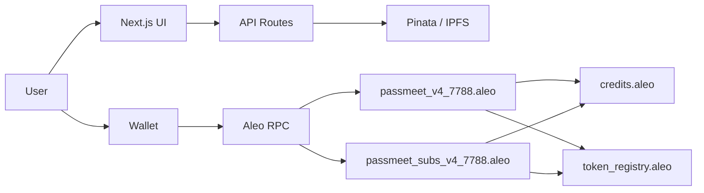

# PassMeet (Aleo Testnet)

PassMeet is a privacy-first event ticketing and gate verification app built on Aleo. Tickets are private Aleo records, and entry is verified on-chain with zero-knowledge proofs plus one-time nullifiers to prevent replay.

---

## What We've Built

This repo includes:

- **Next.js 15 app** — Frontend + API routes with App Router
- **Two Aleo programs** — Events/tickets (`passmeet_v4_7788.aleo`) and subscriptions (`passmeet_subs_v4_7788.aleo`)
- **IPFS metadata** — Pinata persistence (optional but recommended)
- **First-class payment rails** — `credits.aleo`, USDCx, and USAD via `token_registry.aleo`

---

## Features Implemented

### Payments (Hackathon Compliance)

- **Stablecoin rails** — USDCx and USAD are handled via `token_registry.aleo` using a single payment primitive (no placeholder token IDs when configured)
- **Atomic ticket purchase** — Transfer + mint happens in one on-chain flow; sold-out or stale `ticket_id` failures do not charge the buyer
- **Atomic subscription purchase** — Paid subscriptions store validity using chain `block.height` (no browser-time truth)
- **Per-rail on-chain pricing** — Events support `price_credits`, `price_usdcx`, and `price_usad`; `0` disables a rail
- **Split flows** — Free events use `mint_free_ticket`; paid events use `purchase_ticket_with_credits` (credits) or `purchase_ticket` (USDCx/USAD)

### Minting + Gate Reliability

- **Shield Wallet compatible** — All `Mapping::get()` calls moved from transitions into finalize functions (Shield rejects mapping reads in transitions)
- **Ticket ID concurrency** — Client re-reads on-chain `ticket_count` before each mint attempt; retries on stale `ticket_id` failures
- **Transaction state handling** — Explicit states: `submitted`, `confirmed`, `timed_out`, `failed`, `rejected`; no "phantom success" when a tx is still pending
- **Gate verification** — Uses wallet-native records; no non-standard `version` field injection; recovery via `requestTransactionHistory` before retrying

### Privacy Model (Nullifiers)

- **Unpredictable nullifiers** — Gate verification hashes a collision-free tuple `(event_id, ticket_id)` so `(1,2)` and `(2,1)` cannot collide
- **Private by default** — Ticket ownership, payments, and gate proofs remain private; only validity and nullifier spend are on-chain

### Security + Ops

- **Server-verified auth** — Wallet signatures verified server-side; HttpOnly cookie sessions (no localStorage auth fallbacks)
- **Events API protected** — `POST /api/events` requires a valid session; returns 401 if unauthenticated
- **Rate limiting** — Best-effort per-IP rate limiting on auth routes (`nonce`, `verify`)
- **Env security** — `.env`, `.env.local` gitignored; `PASSMEET_AUTH_SECRET` enforced (32+ chars)
- **Image allowlist** — Restricted to known hosts (Unsplash + IPFS gateways)
- **Clean audit** — `npm audit` clean (0 known vulnerabilities)

### Metadata Durability

- **Explicit persistence** — Event creation only shows "created" when both on-chain event and metadata write succeed
- **Graceful fallback** — If IPFS is unavailable, events still load from on-chain data with placeholder metadata
- **Safe IPFS updates** — Upload new index first, then retire old (no destructive unpin-before-success)

---

## Name, Description, Problem Being Solved

### Name
PassMeet

### Description
Privacy-preserving event creation, ticket purchase/mint, and gate verification on Aleo.

### Problem
Traditional ticketing systems leak attendee identity and purchase history, rely on centralized databases, and use QR codes that are easy to copy. PassMeet moves ownership and validity checks on-chain while keeping ticket ownership private.

---

## Why Privacy Matters (For Ticketing)

- Attendees prove "I have a valid ticket" without revealing wallet address or transaction history
- Organizers prevent ticket reuse without maintaining a central attendee list
- Reducing off-chain PII and central databases reduces breach and surveillance risk

---

## Architecture Overview

### Components

| Component | Description |
|-----------|-------------|
| **Next.js App Router** | Organizer dashboard, tickets, gate, subscription pages |
| **API Routes** | Auth (nonce, verify, session, logout), events metadata (IPFS) |
| **Aleo Programs** | `passmeet_v4_7788.aleo` (events/tickets), `passmeet_subs_v4_7788.aleo` (subscriptions) |
| **Payments** | `credits.aleo` for Aleo credits; `token_registry.aleo` for USDCx/USAD |
| **RPC** | Provable Explorer API (primary); JSON-RPC fallback configurable |
| **Wallets** | Shield, Leo, Puzzle, Fox |

### Data Flow

- **Create event** — UI → wallet `create_event(capacity, price_credits, price_usdcx, price_usad)` → `POST /api/events` (metadata to IPFS)
- **Buy ticket** — Free: `mint_free_ticket(event_id, ticket_id)`; Paid credits: `purchase_ticket_with_credits(event_id, ticket_id, organizer, price, credits_record)`; Paid tokens: `purchase_ticket(event_id, ticket_id, organizer, expected_amount, token_record)`
- **Gate verify** — `verify_entry(ticket)` → one-time nullifier set on-chain
- **Subscribe** — `subscribe_with_credits(tier, treasury, price, credits_record)` or `subscribe(tier, treasury, expected_amount, token_record)`

### High-Level Diagram



---

## Production Hardening (Implemented)

| Area | Status |
|------|--------|
| Shield Wallet mint | ✅ Fixed (mapping reads in finalize only) |
| Payment rails | ✅ Credits + USDCx/USAD via token_registry |
| Auth sessions | ✅ Server-verified, HttpOnly cookies |
| Transaction states | ✅ No phantom success |
| Events API | ✅ Session auth on POST |
| Nullifiers | ✅ Collision-free |
| Env security | ✅ .env.local gitignored, secret enforced |
| RPC fallback | ✅ Configurable (testnet3 deprecated) |

---

## Setup (Local Dev)

### Prerequisites

- Node.js 18+ (recommend 20)
- Aleo-compatible wallet (Shield, Leo, Puzzle, Fox)

### Environment Variables

Copy `.env.example` to `.env.local` and configure:

| Variable | Required | Description |
|----------|----------|-------------|
| `PASSMEET_AUTH_SECRET` | **Yes** | 32+ char random string. Run `node scripts/generate_auth_secret.mjs` |
| `PINATA_JWT` | No | Enables IPFS metadata; without it, events use placeholder metadata |
| `NEXT_PUBLIC_ALEO_NETWORK` | No | `testnet` or `mainnet` (default: testnet) |
| `NEXT_PUBLIC_ALEO_RPC_URL` | No | Default: https://api.explorer.provable.com/v2 |
| `NEXT_PUBLIC_PASSMEET_V1_PROGRAM_ID` | Yes | Deployed events program (e.g. `passmeet_v4_7788.aleo`) |
| `NEXT_PUBLIC_PASSMEET_SUBS_PROGRAM_ID` | Yes | Deployed subscriptions program |
| `NEXT_PUBLIC_USDCX_TOKEN_ID` | For USDCx | Field literal after token registration |
| `NEXT_PUBLIC_USAD_TOKEN_ID` | For USAD | Field literal after token registration |

### Install and Run

```bash
npm install
npm run dev
```

### Quality Gates

```bash
npm run lint
npm run test:run
npm run build
```

---

## Deploy Contracts (WSL / Leo)

Programs are `@noupgrade`. Contract changes require a new program ID and redeploy.

1. **Build:** `bash scripts/build-leo.sh` (or `npm run build:contracts`)
2. **Deploy:** `export NETWORK=testnet; export ENDPOINT=https://api.explorer.provable.com/v1; bash scripts/deploy-leo.sh`
3. **Update env** with deployed program IDs

Never put your Aleo private key in `.env`. Use `PRIVATE_KEY` in the shell or let the script prompt.

---

## One-Time Admin Configuration (Required for USDCx/USAD)

Token rails need both frontend env vars and on-chain config:

**Event program:**
```leo
configure_tokens(usdcx_token_id, usad_token_id)
```
First caller becomes admin.

**Subscription program:**
```leo
configure(treasury_address, usdcx_token_id, usad_token_id)
```
First caller becomes admin.

**Token registration (one-time):**
```bash
bash scripts/register_and_mint_tokens.sh
bash scripts/check_tokens.sh  # verify
```

---

## Repo Map

| Path | Description |
|------|-------------|
| `src/app/` | Pages (organizer, tickets, gate, subscription) |
| `src/app/api/` | Auth, events API routes |
| `src/context/` | PassMeetContext (events, tickets, auth, buyTicket, verifyEntry) |
| `src/lib/` | aleo, aleo-rpc, aleo-subs-rpc, auth, pinata, walletTx, aleoRecords |
| `contracts/passmeet_events_7788/` | Events + tickets Leo program |
| `contracts/passmeet_subs_7788/` | Subscriptions Leo program |
| `scripts/` | build-leo, deploy-leo, register_and_mint_tokens, generate_auth_secret |

---

## Deployment Checklist (Testnet)

1. Generate auth secret: `node scripts/generate_auth_secret.mjs` → set `PASSMEET_AUTH_SECRET` in Vercel
2. Register + mint USDCx/USAD: `bash scripts/register_and_mint_tokens.sh`
3. Deploy contracts: `bash scripts/deploy-leo.sh`
4. Set env: `NEXT_PUBLIC_PASSMEET_V1_PROGRAM_ID`, `NEXT_PUBLIC_PASSMEET_SUBS_PROGRAM_ID`, token IDs
5. One-time on-chain: `configure_tokens`, `configure`
6. Optional: `PINATA_JWT` for IPFS metadata

---

## Future Work

- Enforce subscription-tier limits (or update tier copy)
- Add `update_event` / `cancel_event` transitions
- Durable metadata index (DB) for production
- More automated tests (walletTx, aleoRecords, auth, contract integration)
- Activity log (tickets, gate verifies, subscriptions)
- Event image upload to IPFS

---

## License

MIT
