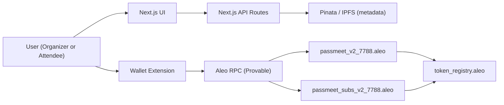

# PassMeet (Aleo Testnet)

PassMeet is a privacy-first event ticketing and gate verification app built on Aleo. Tickets are private Aleo records, and entry is verified on-chain with zero-knowledge proofs plus one-time nullifiers to prevent replay.

This repo includes:
- A Next.js 15 app (frontend + API routes)
- Two Aleo programs (events/tickets and subscriptions)
- IPFS metadata persistence (Pinata, optional but recommended)
- First-class payment rails: `credits.aleo`, USDCx, and USAD (via `token_registry.aleo`)

## Update

This release hardens PassMeet for Aleo Testnet end-to-end (contracts + web app):

- Contracts: per-rail on-chain pricing (`price_credits`, `price_usdcx`, `price_usad`), split free mint vs paid purchase, atomic payment + mint/subscribe flows, collision-free nullifiers, and Shield-friendly ZK constraints (no mapping reads in `transition`; reads/writes moved to `finalize`).
- Payments: first-class support for `credits.aleo` plus Aleo token payments via `token_registry.aleo` (USDCx/USAD when configured).
- Frontend: explicit transaction lifecycle (`submitted`, `confirmed`, `timed_out`, `failed`, `rejected`) and no "phantom success"; organizer UI sets per-rail prices and attendee UI selects a payment rail.
- Auth + sessions: server-verified wallet signatures with HttpOnly cookie sessions (no localStorage auth fallbacks).
- Metadata durability: IPFS writes are treated as part of "created"; if IPFS is unavailable, events still show from on-chain data with placeholder metadata.
- Quality gates: `npm run lint`, `npm run test:run`, `npm run build`.

## Name, Description, Problem Being Solved

### Name
PassMeet

### Description
Privacy-preserving event creation, ticket purchase/mint, and gate verification on Aleo.

### Problem
Traditional ticketing systems leak attendee identity and purchase history, rely on centralized databases, and use QR codes that are easy to copy. PassMeet moves ownership and validity checks on-chain while keeping ticket ownership private.

## Why Privacy Matters (For Ticketing)

- Attendees should be able to prove "I have a valid ticket" without revealing their wallet address or their full transaction history to an organizer, venue staff, or an app backend.
- Organizers should be able to prevent ticket reuse (replay) without maintaining a central list of attendees.
- Reducing off-chain PII and central databases reduces breach risk and surveillance risk.

## Architecture Overview

### Components

- Next.js App Router UI
  - Organizer dashboard: create events, set per-rail prices
  - Tickets: mint free tickets or purchase paid tickets
  - Gate: verify entry on-chain
  - Subscription: paid tiers with on-chain validity
- Next.js API routes
  - Auth: server-verified wallet signature sessions via HttpOnly cookies
  - Events metadata: IPFS persistence and index management (Pinata when configured)
- Aleo programs
  - `passmeet_v2_7788.aleo`: events, tickets, payment-atomic purchase, verify-entry nullifiers
  - `passmeet_subs_v2_7788.aleo`: subscriptions, payment-atomic subscribe, validity by block height
- Payments
  - `credits.aleo` for private credits transfers
  - `token_registry.aleo` for USDCx/USAD tokens using a single payment primitive
- RPC provider
  - Default: Provable Explorer API (`NEXT_PUBLIC_ALEO_RPC_URL`)
- Wallet extensions
  - Shield, Leo, Puzzle, Fox (wallet UX and confirmation speed can differ)

### High-Level Diagram



### Data Flow (Core Paths)

- Create event
  - UI -> wallet executes `create_event(capacity, price_credits, price_usdcx, price_usad)` on `passmeet_v2_7788.aleo`
  - UI -> `POST /api/events` writes metadata to IPFS (Pinata) and updates the index
  - The UI only claims "created" once on-chain succeeds; metadata failures are surfaced and the event remains discoverable from on-chain data with placeholder metadata
- Buy ticket / mint ticket (atomic)
  - Free event: `mint_free_ticket(event_id, ticket_id)`
  - Paid with credits: `purchase_ticket_with_credits(event_id, ticket_id, credits_record)`
  - Paid with tokens: `purchase_ticket(event_id, ticket_id, token_registry.aleo/Token)` (USDCx/USAD)
  - Payment transfer and ticket mint happen in one transaction flow so stale `ticket_id` / sold-out events fail without charging and without minting
- Gate verify
  - Wallet executes `verify_entry(ticket)` which sets a one-time nullifier on-chain
- Subscribe
  - `subscribe_with_credits(tier, credits_record)` or `subscribe(tier, token_record)` on `passmeet_subs_v2_7788.aleo`
  - Contract stores `start_height` / `end_height` using `block.height` (no browser-time truth)

## Privacy Model (What Is Private, What Is Public)

### Private by default
- Ticket ownership: tickets are Aleo records held in the user's wallet.
- Gate verification: the chain learns "a valid ticket was used and the nullifier is now spent" but ticket ownership is not revealed to the organizer UI or backend.
- Payments: credits/token transfers are performed privately using Aleo primitives (`credits.aleo` and `token_registry.aleo`).

### Public/observable
- That transactions happened (normal blockchain visibility).
- Event on-chain state such as capacity, ticket_count, and per-rail prices.
- Optional event metadata stored on IPFS (name/date/location/image). Avoid putting sensitive attendee data in metadata.

### Anti-replay
- The event program computes a collision-free nullifier based on `(event_id, ticket_id)` and stores it in a mapping so a ticket cannot be verified twice.

## Production Hardening (Implemented)

This repo was hardened to remove demo-style fallbacks and improve reliability end-to-end on Aleo Testnet:

- Real wallet auth sessions (server-verified signatures, HttpOnly cookie sessions)
- Reliable transaction states (no "phantom success" when a tx is still pending)
- Per-rail on-chain pricing and atomic paid purchase flows for:
  - `credits.aleo`
  - USDCx / USAD via `token_registry.aleo`
- Subscription payments are atomic and validity is based on chain block height
- Metadata persistence is explicit: if IPFS storage is unavailable, the app does not silently pretend metadata was saved
- Lint/test/build gates remain green (`npm run lint`, `npm run test:run`, `npm run build`)

## Setup (Local Dev)

### Prerequisites
- Node.js 18+ (recommend 20)
- An Aleo-compatible wallet extension (Shield/Leo/Puzzle/Fox)

### Environment Variables
Copy `.env.example` to `.env.local` and set values:

- `PASSMEET_AUTH_SECRET` (required, generate a random 32+ char string)
- `PINATA_JWT` (optional: enables event metadata persistence on IPFS; without it events still load from on-chain data with placeholder metadata)
- `NEXT_PUBLIC_ALEO_NETWORK` (`testnet` or `mainnet`)
- `NEXT_PUBLIC_ALEO_RPC_URL` (recommended: https://api.explorer.provable.com/v2)
- `NEXT_PUBLIC_PASSMEET_V1_PROGRAM_ID` (Your deployed events Leo program)
- `NEXT_PUBLIC_PASSMEET_SUBS_PROGRAM_ID` (Your deployed subscriptions Leo program)
- Token rails (optional, but if you enable token pricing in the UI they must be configured on-chain too)
  - `NEXT_PUBLIC_TOKEN_REGISTRY_PROGRAM_ID` (`token_registry.aleo`)
  - `NEXT_PUBLIC_USDCX_TOKEN_ID` (field literal, e.g. `123456789field`)
  - `NEXT_PUBLIC_USAD_TOKEN_ID` (field literal, e.g. `123456789field`)

### Install and Run

```bash
npm install
npm run dev
```

### Quality Gates

```bash
npm run lint
npm run test:run
npm run build
```

## Deploy Contracts (WSL / Leo)

The Aleo programs in this repo are `@noupgrade`. If you change contract code after a successful deploy, you must bump the program IDs and deploy again.

1. (Optional) Bump program IDs (only needed if the program name is already deployed on-chain): `bash scripts/bump-program-ids.sh`
2. Deploy (broadcasts to testnet by default): `export NETWORK=testnet; export ENDPOINT=https://api.explorer.provable.com/v1; bash scripts/deploy-leo.sh`
3. Set `NEXT_PUBLIC_PASSMEET_V1_PROGRAM_ID` and `NEXT_PUBLIC_PASSMEET_SUBS_PROGRAM_ID` in `.env.local` (and in Vercel) to match what you deployed.

Never put your Aleo private key in `.env` files. `scripts/deploy-leo.sh` will prompt for it (hidden input), or you can set `PRIVATE_KEY` for the current shell session.

## One-Time Admin Configuration (Required for USDCx/USAD)

Token rails require both:
1. Frontend env vars (so the UI can request the right records), and
2. On-chain contract configuration (so the contract will accept those token IDs)

Event program:
- Call `configure_tokens(usdcx_token_id, usad_token_id)` once (first caller becomes admin).

Subscription program:
- Call `configure(treasury_address, usdcx_token_id, usad_token_id)` once (first caller becomes admin).

## PMF and GTM (Outline)

### Product-Market Fit (PMF) Hypothesis
- ICP (beachhead): privacy-conscious communities, invite-only events, conferences/meetups that want cryptographic access control without leaking attendee lists.
- Core value: "prove entry without doxxing yourself" plus on-chain enforcement against reuse.
- Success metrics: event creation -> purchase -> gate verify conversion, support load per 1k users, wallet completion time, repeat organizer usage.

### Go-To-Market (GTM) Plan
- Phase 1 (Testnet pilots): partner with Aleo ecosystem events and hackathons; ship a repeatable wallet matrix playbook (Shield/Leo/Puzzle/Fox).
- Phase 2 (Integrations): lightweight export/import with existing event tools (Luma/Calendly-style flows), simple QR-less gate UX, organizer onboarding.
- Phase 3 (Mainnet launch): paid organizer subscriptions, per-ticket fees, and token rails as default for stable pricing.
- Distribution: ecosystem grants, community partnerships, ambassadors, and bundling with venue tooling.

## Repo Map

- `src/`: Next.js app + route handlers
- `contracts/passmeet_v1_7788/`: event + ticket Aleo program
- `contracts/passmeet_subs_7788/`: subscription Aleo program
- `.env.example`: environment template
