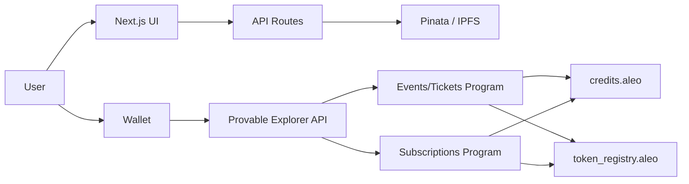

# PassMeet (Aleo Testnet)

PassMeet is a privacy-first event ticketing and gate verification app built on Aleo. Tickets are private Aleo records; entry is verified on-chain using zero-knowledge proofs plus a one-time nullifier to prevent replay.

---

## Update (March 26, 2026)

Summary of what was implemented in this repo to make the app reliable and "production-ready for testnet":

- Real payments: `credits.aleo` plus USDCx/USAD via `token_registry.aleo` (no placeholder token IDs).
- Atomic paid flows: payment transfer and ticket mint (or subscription purchase) happen in one on-chain flow.
- Shield compatibility: no `Mapping::get()` in transitions; all reads happen in finalize.
- Wallet auth sessions: server-verified signature flow with an HttpOnly cookie (no localStorage auth fallback).
- Transaction UX hardening: explicit `submitted/confirmed/timed_out/failed/rejected` states; no phantom success.
- RPC hardening: mapping reads prefer Provable `/v1` (even if `NEXT_PUBLIC_ALEO_RPC_URL` is `/v2`) and correctly handle "200 + null" responses.
- Metadata durability: optional Pinata/IPFS with timeouts; fallback to on-chain discoverability if IPFS is missing.
- DevOps scripts: WSL-friendly deploy, bump program IDs, token registration + minting, and auth-secret generation.
- QR entry flow: attendees can generate a PassMeet entry QR, and the gate page can decode a QR payload from a pasted link or uploaded camera image.
- Secondary market desk: added a private resale listing board with reserve flow and multi-rail price discovery. Current deployed testnet contracts still require a future transfer transition for full seller-to-buyer ticket settlement.
- Multi-wallet readiness: added clearer support guidance for Shield, Leo, Puzzle, and Fox.
- Runtime health visibility: added `GET /api/health` so deployments can be checked quickly with `curl`.

WaveHack additions shipped in this pass:

- `QR code entry scanning`
- `Secondary market / private resale desk`
- `Credits + USDCx + USAD pricing and checkout UX improvements`
- `Operational health endpoint and local verification workflow`
- `README refresh with test/build/runtime verification notes`

---

## Name, Description, Problem Being Solved

### Name

PassMeet

### Description

Privacy-preserving event creation, ticket purchase/mint, and gate verification on Aleo.

### Problem

Traditional ticketing systems leak attendee identity and purchase history, rely on centralized databases, and use QR codes that are easy to copy. PassMeet moves ownership and validity checks on-chain while keeping ticket ownership private.

---

## Why Privacy Matters (For Ticketing)

- Attendees prove "I have a valid ticket" without revealing wallet address or transaction history.
- Organizers prevent ticket reuse without maintaining a central attendee list.
- Reducing off-chain PII and central databases reduces breach and surveillance risk.

---

## Privacy Model Explanation

PassMeet is designed so "ownership and validity" can be verified without creating a public attendee list.

What is private:

- Ticket ownership is a private `Ticket` record owned by the attendee.
- Payments use private records: `credits.aleo/credits` and `token_registry.aleo/Token`.
- Gate verification consumes the private ticket record; the verifier does not need a public attendee registry.

What is public:

- Event parameters and counts (capacity, ticket_count, on-chain pricing rails) are stored in mappings.
- A one-time nullifier spend is stored on-chain to prevent replay (no QR re-use).

Nullifier design:

- The nullifier is derived from a collision-free tuple that includes the (private) ticket owner:
  - `hash(ticket_owner, event_id, ticket_id) -> field`
- This prevents collisions (e.g. `(1,2)` vs `(2,1)`) and prevents third parties from precomputing which tickets have been used.

---

## Architecture Overview

### Components


| Component          | Description                                                              |
| ------------------ | ------------------------------------------------------------------------ |
| Next.js App Router | Organizer dashboard, tickets, gate, subscription pages                   |
| API Routes         | Auth (nonce, verify, session, logout), event metadata persistence (IPFS) |
| Aleo Programs      | Events/tickets and subscriptions programs (IDs are configurable via env) |
| Payments           | `credits.aleo` for credits; `token_registry.aleo` for USDCx/USAD         |
| RPC                | Provable Explorer REST (`/v1` for mappings), optional JSON-RPC fallback  |
| Wallets            | Shield, Leo, Puzzle, Fox                                                 |


### Programs (This Repo)

- Events/Tickets: `passmeet_v4_7788.aleo`
- Subscriptions: `passmeet_subs_v4_7788.aleo`

These programs are `@noupgrade`. Any contract change requires deploying under new, unique program IDs.

### Data Flow

- Create event:
  - UI -> wallet `create_event(capacity, price_credits, price_usdcx, price_usad)`
  - Optional: `POST /api/events` to persist metadata to IPFS
- Buy ticket:
  - Free: `mint_free_ticket(event_id, ticket_id)`
  - Paid credits: `purchase_ticket_with_credits(event_id, ticket_id, organizer, price, credits_record)`
  - Paid tokens: `purchase_ticket(event_id, ticket_id, organizer, expected_amount, payment_token_id, token_record)`
- Gate verify:
  - `verify_entry(ticket)` -> one-time nullifier set on-chain
- Subscribe:
  - Credits: `subscribe_with_credits(tier, treasury, price, credits_record)`
  - Tokens: `subscribe(tier, treasury, expected_amount, payment_token_id, token_record)`

### High-Level Diagram




---

## Product Market Fit (PMF) and Go-To-Market (GTM)

PMF hypothesis:

- People want tickets that are hard to counterfeit, easy to verify, and do not create a public attendee list.
- Organizers want fewer fraud/support cases and simpler gate operations without collecting PII.

Initial target users:

- Web3 conferences and meetups (attendees already have wallets).
- Privacy-sensitive communities (invite-only events, DAOs, alumni groups).
- Hackathons and ecosystem events (fast distribution + feedback loops).

GTM plan (testnet -> mainnet):

- Start with Aleo ecosystem pilots: 2-5 organizers, measure gate throughput and failure rate.
- Publish a "gate kit" playbook: best practices, wallet matrix recommendations, and fallback flows.
- Partner integrations: wallets, community platforms, and event hosts with existing ticketing friction.
- Expand rails: stablecoin-first pricing for USD-denominated tickets while keeping credits.aleo available.

---

## Setup (Local Dev)

### Prerequisites

- Node.js 18+ (recommend 20)
- Aleo-compatible wallet (Shield, Leo, Puzzle, Fox)

### Environment Variables

Copy `.env.example` to `.env.local` and configure:


| Variable                                | Required       | Description                                                                                |
| --------------------------------------- | -------------- | ------------------------------------------------------------------------------------------ |
| `PASSMEET_AUTH_SECRET`                  | Yes            | 32+ char random string (used to sign the session cookie). Placeholder values are rejected. |
| `NEXT_PUBLIC_ALEO_NETWORK`              | No             | `testnet` or `mainnet` (default: testnet)                                                  |
| `NEXT_PUBLIC_ALEO_RPC_URL`              | No             | Default: `https://api.explorer.provable.com/v2` (mapping reads will still prefer `/v1`)    |
| `NEXT_PUBLIC_ALEO_JSON_RPC`             | No             | Optional JSON-RPC fallback for mapping reads                                               |
| `NEXT_PUBLIC_PASSMEET_V1_PROGRAM_ID`    | Yes            | Deployed events program ID                                                                 |
| `NEXT_PUBLIC_PASSMEET_SUBS_PROGRAM_ID`  | Yes            | Deployed subscriptions program ID                                                          |
| `NEXT_PUBLIC_TOKEN_REGISTRY_PROGRAM_ID` | Yes (payments) | `token_registry.aleo`                                                                      |
| `NEXT_PUBLIC_USDCX_TOKEN_ID`            | For USDCx      | Field literal after token registration                                                     |
| `NEXT_PUBLIC_USAD_TOKEN_ID`             | For USAD       | Field literal after token registration                                                     |
| `PINATA_JWT`                            | No             | Enables IPFS metadata persistence                                                          |
| `NEXT_PUBLIC_GATEWAY_URL`               | No             | IPFS gateway for image/metadata reads                                                      |


Generate a real auth secret (writes to `.env.local` if missing):

```bash
node scripts/generate_auth_secret.mjs
```

Install and run:

```bash
npm install
npm run dev
```

Quality gates:

```bash
npm run lint
npm run test:run
npm run build
```

Runtime probes after build:

```bash
curl http://localhost:3000/api/health
curl http://localhost:3000/api/resale
curl -I http://localhost:3000/
curl -I http://localhost:3000/gate
```

Note: In some restricted Windows environments, `next build` and test runners can fail due to process spawn restrictions. Use WSL or CI (Linux) as the authoritative build/test pass.

### Verified In This Repo Update

The following checks were run successfully on March 26, 2026:

- `npm install`
- `npm run lint`
- `npx tsc --noEmit`
- `npm run test:run`
- `npm run build`
- `curl http://localhost:3000/api/health`
- `curl http://localhost:3000/api/resale`
- `curl -I http://localhost:3000/`
- `curl -I http://localhost:3000/gate`

Observed runtime status from `/api/health` during verification:

- app status: `ok`
- network: `testnet`
- RPC reachable: `true`
- latest block height was returned successfully
- QR entry, resale desk, and multi-currency feature flags were exposed

---

## Deploy Contracts (WSL / Leo)

These programs are `@noupgrade`. Any contract change requires a new program ID deployment.

If you already deployed the current program IDs, bump to a new unique version:

```bash
export NETWORK=testnet
export ENDPOINT=https://api.explorer.provable.com/v1
bash scripts/bump-program-ids.sh
```

Deploy:

```bash
export NETWORK=testnet
export ENDPOINT=https://api.explorer.provable.com/v1
bash scripts/deploy-leo.sh
```

Never put your Aleo private key in `.env`. Use `PRIVATE_KEY` in your shell or let the script prompt.

---

## One-Time Admin Configuration (Required for USDCx/USAD)

Token rails need both frontend env vars and on-chain config.

Event program (first caller becomes admin):

```leo
configure_tokens(usdcx_token_id, usad_token_id)
```

Subscription program (first caller becomes admin):

```leo
configure(treasury_address, usdcx_token_id, usad_token_id)
```

Token registration + mint (one-time):

```bash
bash scripts/register_and_mint_tokens.sh
bash scripts/check_tokens.sh
```

---

## Repo Map


| Path                                    | Description                                                               |
| --------------------------------------- | ------------------------------------------------------------------------- |
| `src/app/`                              | Pages (organizer, tickets, gate, subscription)                            |
| `src/app/api/`                          | Auth and event metadata routes                                            |
| `src/app/api/health/route.ts`           | Deployment/testnet readiness endpoint                                     |
| `src/app/api/resale/route.ts`           | Resale listing read/write API                                             |
| `src/context/`                          | PassMeetContext (events, tickets, auth, buyTicket, verifyEntry)           |
| `src/lib/`                              | Aleo config + RPC helpers, auth helpers, Pinata, walletTx, record parsing |
| `src/components/EntryQrDialog.tsx`      | Ticket QR generation dialog                                               |
| `src/components/ResaleMarketPanel.tsx`  | Secondary market listing UI                                               |
| `src/components/WalletSupportPanel.tsx` | Wallet compatibility UX copy                                              |
| `contracts/passmeet_events_7788/`       | Events + tickets Leo program                                              |
| `contracts/passmeet_subs_7788/`         | Subscriptions Leo program                                                 |
| `scripts/`                              | build/deploy, bump IDs, token registration, auth secret                   |


---

## Deployment Checklist (Testnet)

1. Generate auth secret: `node scripts/generate_auth_secret.mjs` then set `PASSMEET_AUTH_SECRET` in your deployment env.
2. Register + mint USDCx/USAD (one-time): `bash scripts/register_and_mint_tokens.sh` (verify with `bash scripts/check_tokens.sh`).
3. Deploy contracts (WSL): `bash scripts/deploy-leo.sh` (bump IDs first if needed).
4. Set env: `NEXT_PUBLIC_PASSMEET_V1_PROGRAM_ID`, `NEXT_PUBLIC_PASSMEET_SUBS_PROGRAM_ID`, and token IDs.
5. One-time on-chain admin config: `configure_tokens` (organizer page) and `configure` (subscription page).
6. Optional: set `PINATA_JWT` for IPFS metadata persistence.

---

## Future Work

- Enforce subscription-tier limits (or align tier copy with what is actually enforced).
- Add `update_event` / `cancel_event` transitions.
- Add a durable metadata index (database) for production deployments.
- Add a deployed ticket-transfer transition so resale can settle fully on-chain without organizer-assisted handoff.
- Expand automated tests (walletTx, record parsing, auth routes, contract integration).
- Add an activity log (tickets, gate verifies, subscriptions).
- Support user-uploaded event images stored on IPFS.
- 

---


