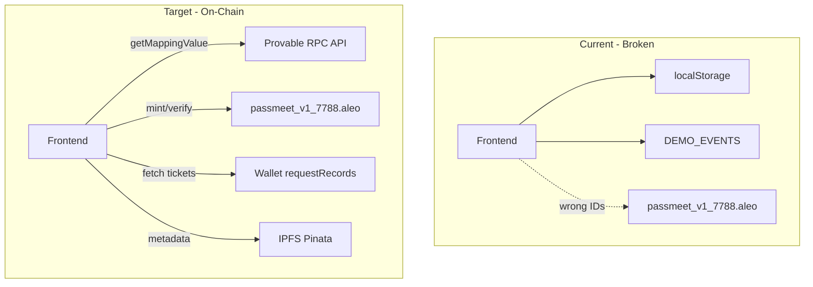

# PassMeet - Full Codebase Audit and Production Readiness Plan

## Executive Summary

Your PassMeet project has **deployed contracts** (`passmeet_v1_7788.aleo`, `passmeet_subs_7788.aleo`) that work on-chain, but the **frontend is largely disconnected** from the blockchain. The judge's feedback ("creating an event works, but I was unable to mint a ticket") is caused by **wrong event IDs** being sent to the contract. This plan fixes all 7 identified issues to make the app fully functional on-chain with no dummy data.

---

## Current State: What Works vs What Does Not

| Feature | Status | Notes |
|---------|--------|-------|
| Create Event | Partially works | Transaction succeeds on-chain, but frontend stores wrong ID (`event_1739...`) instead of on-chain ID (1, 2, 3...) |
| Mint Ticket | **BROKEN** | Sends wrong `event_id` (timestamp or "1" for demo) and wrong `ticket_id`; contract panics or asserts fail |
| Verify Entry | Partially works | Only works if user has a real on-chain ticket; tickets from localStorage are fake |
| Subscription | **FAKE** | Uses `setTimeout` + random hash; never calls `passmeet_subs_7788.aleo` |
| Event List | **FAKE** | Loads from localStorage + hardcoded DEMO_EVENTS; never queries blockchain |
| Tickets List | **FAKE** | Loads from localStorage; never uses `requestRecords` for real on-chain tickets |
| IPFS Metadata | Unused | API route exists but PassMeetContext never calls it; Pinata JWT empty in .env |

---

## Root Cause: The Judge's Mint Bug

The contract's `mint_ticket` expects:
- `event_id`: On-chain auto-incremented ID (1, 2, 3...) from `event_counter` mapping
- `ticket_id`: Must equal `event.ticket_count + 1` (next sequential ticket)

The frontend sends:
- For demo events: `event_id = "1"` (works only if event #1 exists and ticket_count matches)
- For user events: `event_id = "1739000000000"` (timestamp - **does not exist on-chain**)
- `ticket_id = event.ticketCount + 1` from **localStorage**, not on-chain state

**Result:** `Mapping::get(events, event_id)` panics for non-existent events, or `assert(ticket_id == event.ticket_count + 1)` fails when localStorage is out of sync.

---

## Architecture Overview

---

## Implementation Plan

### Phase 1: Fix Core On-Chain Integration (Critical)

#### 1.1 Add Aleo RPC Client for Mapping Queries

Create [src/lib/aleo-rpc.ts](src/lib/aleo-rpc.ts) to fetch on-chain state:

- `getEventCounter()`: Query `event_counter` mapping with key `0u8` to get latest event ID
- `getEvent(eventId: number)`: Query `events` mapping with key `{eventId}u64` to get EventInfo (capacity, price, ticket_count, organizer)
- Use Provable API: `GET {ALEO_RPC_URL}/program/passmeet_v1_7788.aleo/mapping/{mappingName}/{key}`

Reference: [Provable API - Program Mapping Value](https://docs.provable.com/docs/api/v2/get-program-program-id-mapping-mapping-name-key)

#### 1.2 Rewrite `refreshEvents` in [PassMeetContext.tsx](src/context/PassMeetContext.tsx)

- **Remove** `DEMO_EVENTS` entirely (lines 63-90)
- Query `event_counter` to get `maxEventId`
- Loop from 1 to maxEventId, call `getEvent(id)` for each
- Merge with IPFS metadata (name, date, location, image) from `/api/events` if Pinata is configured
- If IPFS fails/empty: show "Event #{id}" with on-chain data only (capacity, price, ticket_count)
- Store events with `id: String(onChainId)` (e.g. `"1"`, `"2"`) so `buyTicket` can use correct ID

#### 1.3 Fix `createEvent` in [PassMeetContext.tsx](src/context/PassMeetContext.tsx)

- After successful `requestTransaction`, **poll** `event_counter` (or parse from tx) to get the new event ID
- Store event in localStorage with `id: String(newOnChainId)` (not `event_${Date.now()}`)
- Optionally call `POST /api/events` with metadata (name, date, location) keyed by on-chain ID for IPFS
- Add `organizerAddress: publicKey` for "My Events" filtering

#### 1.4 Fix `buyTicket` in [PassMeetContext.tsx](src/context/PassMeetContext.tsx)

- Use `event.id` directly as on-chain ID (after Phase 1.2, `event.id` will be "1", "2", etc.)
- **Fetch** `ticket_count` from on-chain via `getEvent(parseInt(event.id))` before minting
- Pass `event_id: parseInt(event.id)` and `ticket_id: onChainTicketCount + 1` to `mint_ticket`
- Remove the `event.id.startsWith('demo')` logic entirely

#### 1.5 Fix `refreshTickets` in [PassMeetContext.tsx](src/context/PassMeetContext.tsx)

- Use `requestRecords(PASSMEET_V1_PROGRAM_ID)` to fetch actual Ticket records from the wallet
- Parse records to extract `event_id`, `ticket_id`; match with events from `refreshEvents` for name/date/location
- Replace localStorage as source of truth; use localStorage only as cache for metadata if needed

#### 1.6 Fix `verifyEntry` in [PassMeetContext.tsx](src/context/PassMeetContext.tsx)

- Ensure `eventId` matching uses on-chain format (numeric string "1", "2")
- Pass the **raw record string** from `requestRecords` to `Transaction.createTransaction` (verify wallet adapter expects record as string)

---

### Phase 2: Wire Subscription to Real Contract

#### 2.1 Modify [subscription/page.tsx](src/app/subscription/page.tsx)

- **Remove** `generateTxHash()` (lines 23-30)
- **Remove** `setTimeout(2500)` fake delay
- In `handleSubscribe`, call `Transaction.createTransaction` with:
  - `PASSMEET_SUBS_PROGRAM_ID` (`passmeet_subs_7788.aleo`)
  - transition: `subscribe`
  - params: `[tier.id, 2592000]` (tier as u8, duration in seconds - 30 days)
- Use `requestTransaction` from wallet adapter
- Show **real** tx hash from wallet response in toast

---

### Phase 3: IPFS Metadata (Optional but Recommended)

#### 3.1 Configure Pinata

- Add valid `PINATA_JWT` and `NEXT_PUBLIC_GATEWAY_URL` to [.env.local](.env.local)
- Without this, events will show as "Event #1", "Event #2" with only capacity/price from chain

#### 3.2 Integrate IPFS in PassMeetContext

- After `createEvent` succeeds and we have on-chain ID, call `POST /api/events` with `{ id: onChainId, name, date, location, ... }`
- In `refreshEvents`, after fetching on-chain events, call `GET /api/events` and merge metadata by ID
- Update [api/events/route.ts](src/app/api/events/route.ts) to accept `id` as number (on-chain ID)

---

### Phase 4: Minor Fixes

#### 4.1 Organizer Page Filter Bug

In [organizer/page.tsx](src/app/organizer/page.tsx) line 72:
- `allUserEvents = events.filter(e => e.id.startsWith("user_"))` is **always empty** (events use `event_` or numeric IDs)
- Change to filter by `!e.id.startsWith('demo')` or remove if DEMO_EVENTS are gone

#### 4.2 AleoWalletProvider

In [AleoWalletProvider.tsx](src/components/AleoWalletProvider.tsx):
- `WalletAdapterNetwork.TestnetBeta` may not exist in some adapter versions; ensure only `Testnet` is used if needed
- Verify program IDs in `programIdPermissions` match deployed contracts

---

## Contract Changes: None Required

The contracts [passmeet_v1_7788/src/main.leo](contracts/passmeet_v1_7788/src/main.leo) and [passmeet_subs_7788/src/main.leo](contracts/passmeet_subs_7788/src/main.leo) are correct and deployed. **No redeployment needed.** All fixes are frontend-only.

---

## Verification Checklist

After implementation, manually verify:

1. **Create Event**: Create event, confirm tx on explorer, event appears with correct on-chain ID
2. **Mint Ticket**: Click "Mint Private Ticket" on a real on-chain event, confirm tx, ticket appears in "My Tickets"
3. **Verify Entry**: Use minted ticket at Gate, confirm "ACCESS GRANTED" with real tx hash
4. **Subscription**: Click "Upgrade to Pro", confirm real tx to `passmeet_subs_7788.aleo`
5. **No Dummy Data**: Remove all DEMO_EVENTS; all events must come from chain
6. **Cross-Browser**: Tickets from `requestRecords` persist across sessions; no localStorage-only tickets

---

## File Change Summary

| File | Action |
|------|--------|
| `src/lib/aleo-rpc.ts` | **Create** - RPC helpers for getEventCounter, getEvent |
| `src/context/PassMeetContext.tsx` | **Modify** - Fix refreshEvents, createEvent, buyTicket, refreshTickets, remove DEMO_EVENTS |
| `src/app/subscription/page.tsx` | **Modify** - Wire to real contract, remove generateTxHash |
| `src/app/organizer/page.tsx` | **Modify** - Fix allUserEvents filter |
| `src/app/api/events/route.ts` | **Modify** - Accept numeric on-chain ID |
| `.env.local` | **Modify** - Add Pinata JWT (user action) |

---

## Risk: RPC Endpoint Compatibility

The Provable API base URL in your config is `https://api.explorer.provable.com/v2`. The docs reference `https://api.provable.com/v2/{network}`. If mapping queries fail, try:
- `https://api.explorer.provable.com/v2` (current)
- `https://api.provable.com/v2/testnet` (alternative)
- `https://testnet3.aleorpc.com` with JSON-RPC `getMappingValue` (Aleo native)
